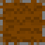

# 制作ゲーム

## トップダウンビューの 2D コロニービルダーゲーム

プレイヤーがエージェントに指示を出すことでコロニーを構築し、エージェントの生存を図るゲームです。  
エージェントはすべて AI で、プレイヤーが直接操作することができず、「構築」や「解体」の指示でのみ関節的に操作できます。  
エージェントには空腹があり、食べ続ける必要があります。胃袋が完全に空になると、エージェントはは死んでしまいます。

Oxygen Not Included からインスピレーションを受け、現在作っているゲームです。  
C# でプログラミングしており、Unity バージョンと Godot バージョンがあります。  
一人で作成しています。

### ダウンロード

- Windows
- macOS

### 捜査方法

マウスの左クリックですべて捜査可能です。  
画面下部にあるボタンをクリックしてから、マップのどこかにクリックすると、エージェントに指示を出せます。  
手が空いたエージェントからその指示を実行します。

ボタンの意味は以下の通りです。

| ボタン                                                | 意味                                                 |
| ----------------------------------------------------- | ---------------------------------------------------- |
|          | 鋼の地面を作る                                       |
|            | 土の地面を作る                                       |
|        | ジャガイモの植物を埋める （土の地面でのみできる） |
|      | 指示をキャンセルする                                 |
|  | 作られたものを解体する                               |

### ゲームプレイ動画

### ソースコード

もともと Unity で作っていたゲームですが、Godot に移行し、現在 Godot バージョンの方を開発しております。  
機能的には Unity バージョンと Godot バージョンは現在ほぼ一緒です。ちょうど Godot への移行が終わったところです。

- Unity バージョン
  - [https://github.com/ershn/spaceship_game](https://github.com/ershn/spaceship_game)
- Godot バージョン
  - [https://github.com/ershn/spaceship_game_godot](https://github.com/ershn/spaceship_game_godot)

### 実装における工夫点

#### async/await を活かしたイベントベースの設計

#### シングルトンはなく、各クラスの行数は抑えられてる

#### ゲームエンティティの挙動はすべてエディター内で設定可能

#### パスファインディングサブシステムを作成

#### カスタムツールの開発で実装コストを軽減
