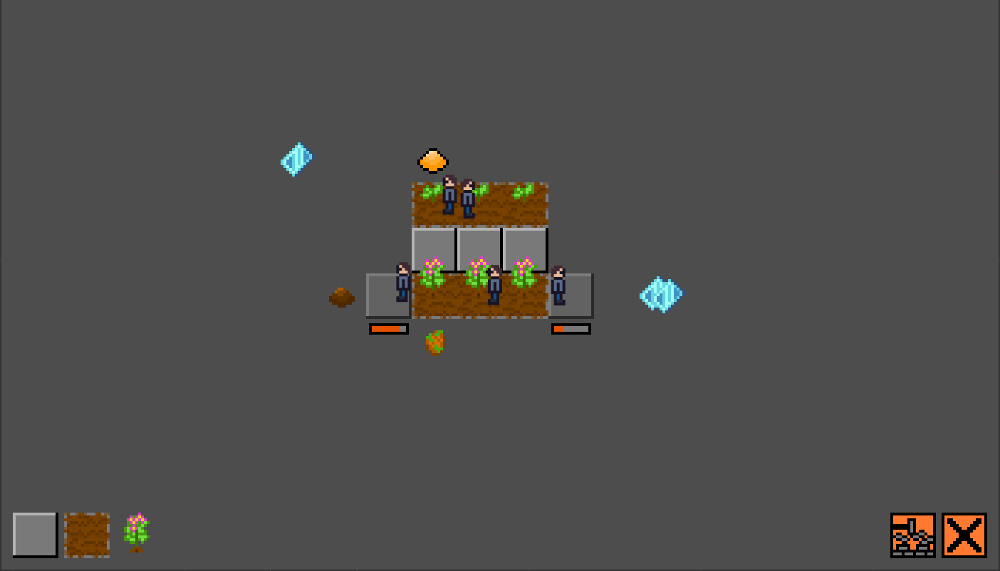
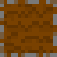
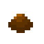
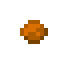
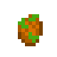
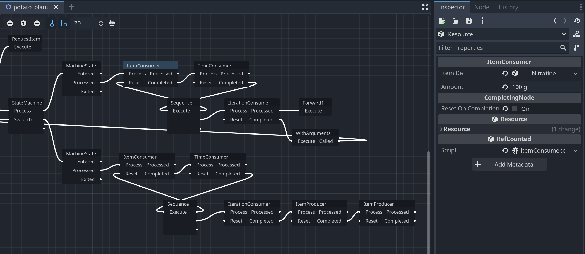
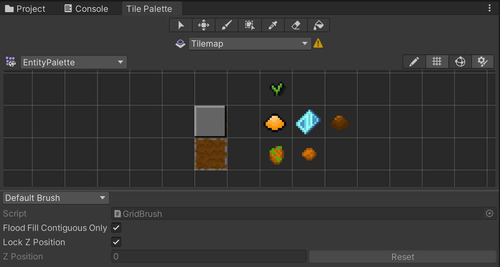

## トップダウンビューの 2D コロニービルダーゲーム



プレイヤーがエージェントに指示を出すことでコロニーを構築し、エージェントの生存を図るゲームです。  
エージェントはすべて AI で、プレイヤーが直接操作することができず、「構築」や「解体」の指示でのみ関節的に操作できます。  
エージェントには空腹があり、食べ続ける必要があります。胃袋が完全に空になると、エージェントは倒れて、死んでしまいます。

Oxygen Not Included からインスピレーションを受け、現在作っているゲームです。  
C# でプログラミングしており、Unity バージョンと Godot バージョンがあります。  
完全に一人で制作しています。

### ダウンロード

- Windows
  - [Colony-builder-windows-x64.zip](https://github.com/ershn/spaceship_game_godot/releases/download/v0.1.0-alpha/Colony-builder-v0.1.0-alpha-windows-x64.zip)
  - ゲームを起動するには、`zip`ファイルを展開して、`exe`ファイルを実行してください
- macOS
  - TBA

### 捜査方法

マウスの左クリックですべて捜査可能です。  
画面下部にあるボタンをクリックしてから、マップのどこかをクリックすると、エージェントに指示を出せます。  
手が空いたエージェントからその指示を実行します。

ボタンの意味は以下の通りです。

| ボタン                                                | 意味                                                 |
| ----------------------------------------------------- | ---------------------------------------------------- |
|          | 鋼のタイルを作る                                       |
|            | 土のタイルを作る                                       |
|        | ジャガイモを埋める<br>（土のタイルでのみできる） |
|      | 指示をキャンセルする                                 |
|  | 作られたものを解体する                               |

以下の表で各アイテムを説明しています。

アイテム画像 | アイテム名称 | 用途
--- | --- | ---
 | 鋼 | 鋼と土タイルの構築に必要
 | 土 | 土タイルの構築に必要
 | ジャガイモ | エージェントの食べ物
 | ジャガイモの種 | ジャガイモを埋めるには必要
 | 硝酸塩鉱物 | ジャガイモを育てるには必要

### ゲームプレイ動画



### ソースコード

もともと Unity で作っていたゲームですが、Godot に移行し、現在 Godot バージョンの方を開発しております。  
機能的には Unity バージョンと Godot バージョンは現在ほぼ一緒です。ちょうど Godot への移行が終わったところです。

- Unity バージョン
  - [https://github.com/ershn/spaceship_game](https://github.com/ershn/spaceship_game)
- Godot バージョン
  - [https://github.com/ershn/spaceship_game_godot](https://github.com/ershn/spaceship_game_godot)

### 実装における工夫点

#### async/await を活かした非同期な設計

必要な時だけ処理が走るようにしています。プーリングはほぼおらず、処理は基本的に非同期に行われます。  
最初はコールバックとイベントのみを使っていましたが、抽象化をしても分かりにくかったので、async/await や`TaskCompletionSource`を活かすようにしました。  
これにより、処理が非同期のままでも同期処理と同じ書き方になり、保守性があがりました。

以下は async/await を使って実装したエージェント用のジョブの一つです（Godotバージョンです）。

```csharp
public sealed class DeliverItemJob : IJob, IDisposable
{
    // ...

    public async Task Execute(PhysicsBody2D executor, CancellationToken ct)
    {
        var mover = executor.GetNode<Mover>("Mover");
        await mover.MoveTo(_item.GlobalPosition, ct);

        var backpack = executor.GetNode<Backpack>("Backpack");
        _item.Remove(_amount);
        backpack.Add(_item.Def, _amount);
        _item = null;

        try
        {
            await mover.MoveTo(_inventory.GlobalPosition, ct);
        }
        catch (TaskCanceledException)
        {
            backpack.Dump();
            throw;
        }

        backpack.Remove(_itemDef, _amount);
        _inventory.Add(_itemDef, _amount);
    }
}
```

関連クラス（Godotバージョン）
- [IJob.cs](https://github.com/ershn/spaceship_game_godot/blob/9c67b4ee4648fe3a1e68f303c5adbfbe3a52a7a6/Scripts/Jobs/IJob.cs)　エージェントが実行するジョブのインターフェイス
- [DeliverItemJob.cs](https://github.com/ershn/spaceship_game_godot/blob/9c67b4ee4648fe3a1e68f303c5adbfbe3a52a7a6/Scripts/Jobs/DeliverItemJob.cs)　アイテムを特定のインベントリーに配達するジョブの実装
- [WorkOnJob.cs](https://github.com/ershn/spaceship_game_godot/blob/9c67b4ee4648fe3a1e68f303c5adbfbe3a52a7a6/Scripts/Jobs/WorkOnJob.cs)　エージェントの労力が必要な作業を対応するジョブの実装
- [JobScheduler.cs](https://github.com/ershn/spaceship_game_godot/blob/9c67b4ee4648fe3a1e68f303c5adbfbe3a52a7a6/Scripts/Jobs/JobScheduler.cs)　未処理ジョブをエージェントに配るスケジューラー
- [JobExecutor.cs](https://github.com/ershn/spaceship_game_godot/blob/9c67b4ee4648fe3a1e68f303c5adbfbe3a52a7a6/Scripts/Jobs/JobExecutor.cs)　エージェントにアタッチされてる、実際にジョブを実行するクラス

#### コンポーネントの再利用性を重視したモジュラーな設計

コンポーネントの再利用性を高めるために以下のアクションを取ってます。
- シングルトンは避けて、`static`変数も基本的に使っていません
- できる場合はオブジェクトのリファレンスをエディター内で設定し、できない場合は`GetNode`(Godot)や`GetComponent`(Unity)で取得するようにしてます
- ジョブのスケジューラーなどエンティティ間で共有されるオブジェクトは hierarchy で親オブジェクトとして置くようにして、child オブジェクトから簡単に取得できるようにしてます
- 単一責任を重視し、各クラスが一つだけなことをするように心がけてます

#### コードレスなゲームエンティティ定義方法の用意

ゲームエンティティの定義はすべてエディター内で`Resource`(Godot)か`ScriptableObject`(Unity)を使って、行っています。  
鋼タイルやジャガイモアイテムなど、特定のゲームエンティティにしか使われないスクリプトは基本的にありません。  
新しい挙動が必要となった場合は汎用的に実装し、どんなエンティティでも利用できるようにしています。

以下は`ScriptableObject`から継承している、建築物を定義するためのベースクラスです（Unityバージョンです）。

```csharp
public abstract class StructureDef : EntityDef, IWorldLayerGet
{
    public abstract WorldLayer WorldLayer { get; }

    [Header("Graphics")]
    [SerializeReference, Polymorphic]
    public StructureGraphicsDef StructureGraphicsDef;

    [Header("Construction")]
    public ItemDefAmount[] ComponentAmounts;
    public float ConstructionTime = 10f;
    public float DeconstructionTimeMultiplier = .5f;

    [Header("Status")]
    public bool SetupRequired = false;

    [Header("Health")]
    public int MaxHealthPoints = 100;

    [Header("Resource processing")]
    public StateGraphAsset ResourceProcessor;

    public abstract bool IsConstructibleAt(
        GridIndexes gridIndexes,
        Vector2Int cellPosition,
        bool ignoreExisting = false
    );
}
```

関連クラス（Unityバージョン）
- [StructureDef.cs](https://github.com/ershn/spaceship_game/blob/23a2c0a21dbd82c7a1ba799f827d7a587800b7f8/Assets/Scripts/StructureDef.cs)　建築物定義のベースクラス
- [FloorDef.cs](https://github.com/ershn/spaceship_game/blob/23a2c0a21dbd82c7a1ba799f827d7a587800b7f8/Assets/Scripts/FloorDef.cs)　地面タイルの定義クラス（`StructureDef`から継承）
- [FurnitureDef.cs](https://github.com/ershn/spaceship_game/blob/23a2c0a21dbd82c7a1ba799f827d7a587800b7f8/Assets/Scripts/FurnitureDef.cs)　地面タイルに建てる建築物の定義クラス（`StructureDef`から継承）
- [ItemDef.cs](https://github.com/ershn/spaceship_game/blob/23a2c0a21dbd82c7a1ba799f827d7a587800b7f8/Assets/Scripts/ItemDef.cs)　アイテムの定義クラス
- [StructureSpriteGraphicsDef.cs](https://github.com/ershn/spaceship_game/blob/23a2c0a21dbd82c7a1ba799f827d7a587800b7f8/Assets/Scripts/StructureSpriteGraphicsDef.cs)　建築物のスプライトグラフィックス定義クラス
- [StructureTileGraphicsDef.cs](https://github.com/ershn/spaceship_game/blob/23a2c0a21dbd82c7a1ba799f827d7a587800b7f8/Assets/Scripts/StructureTileGraphicsDef.cs)　建築物のタイルマップグラフィック定義クラス

#### パスファインディングサブシステムを実装

ゲームの Unity バージョン限定ですが、パスファインディングライブラリーを自作し、使用しています。  
グリッドグラフと A* によるパスファインディングを実装しています。

関連クラス（Unityバージョン）
- [GridGraph.cs](https://github.com/ershn/spaceship_game/blob/23a2c0a21dbd82c7a1ba799f827d7a587800b7f8/Assets/Scripts/PathFinding/GridGraph.cs)　グリッドグラフの実装
- [AStarGridNode.cs](https://github.com/ershn/spaceship_game/blob/23a2c0a21dbd82c7a1ba799f827d7a587800b7f8/Assets/Scripts/PathFinding/AStarGridNode.cs)　A*を使うためのグリッドグラフノード
- [AStarPathFinder.cs](https://github.com/ershn/spaceship_game/blob/23a2c0a21dbd82c7a1ba799f827d7a587800b7f8/Assets/Scripts/PathFinding/AStarPathFinder.cs)　実際のA*アルゴリズムの実装
- [PathRequest.cs](https://github.com/ershn/spaceship_game/blob/23a2c0a21dbd82c7a1ba799f827d7a587800b7f8/Assets/Scripts/PathFinding/PathRequest.cs)　パスファインディングリクエストを表現するクラス
- [PathRequestManager.cs](https://github.com/ershn/spaceship_game/blob/23a2c0a21dbd82c7a1ba799f827d7a587800b7f8/Assets/Scripts/PathFinding/PathRequestManager.cs)　パスファインディングリクエストのキューイングと処理を担当するクラス
- [PathSeeker.cs](https://github.com/ershn/spaceship_game/blob/23a2c0a21dbd82c7a1ba799f827d7a587800b7f8/Assets/Scripts/PathFinding/PathSeeker.cs)　パスファインディングをリクエストできるクラス（必要なエンティティにつけるコンポーネント）

#### カスタムツールの開発で実装コストを軽減

ゲームをより簡単に作るためにカスタムツールをいくつか作成しています。  
実装方法や仕様は多少異なりますが、Godot と Unity で同じ用途のツールを作っています。

作ったツールには以下があります。
- エディター内でゲームエンティティを簡単に配置するためのパレットとブラッシュ（Unityではカスタムブラッシュとして実装）
- `ulong`として格納されるアイテムの重量を`mg`, `g`, `kg`, `t`の単位で表示・編集するためのプロパティドロワー
- ゲームエンティティのリソース処理をエディター内で定義するためのグラフエディター（Godotではゼロから実装、Unityでは Visual scripting のためのカスタムノードを実装）
- ゲームエンティティのプリハブを自動生成するためのスクリプト（Unityのみ）
- 多相クラスプロパティのためのプロパティドロワー（Unityのみ）
- `Dictionary`プロパティのシリアライザーとプロパティドロワー（Unityのみ）

関連クラス（Godotバージョン）
- [AmountInspector/Property.cs](https://github.com/ershn/spaceship_game_godot/blob/9c67b4ee4648fe3a1e68f303c5adbfbe3a52a7a6/addons/AmountInspector/Property.cs)　アイテム重量のためのプロパティエディター
- [EntityDrawer/Plugin.cs](https://github.com/ershn/spaceship_game_godot/blob/9c67b4ee4648fe3a1e68f303c5adbfbe3a52a7a6/addons/EntityDrawer/Plugin.cs)　ゲームエンティティを配置するためのパレットとブラッシュ
- [LogicGraph.cs](https://github.com/ershn/spaceship_game_godot/blob/9c67b4ee4648fe3a1e68f303c5adbfbe3a52a7a6/Scripts/LogicGraphs/LogicGraph.cs)　ゲームエンティティのリソース処理を表現するグラフクラス
- [GraphEditor.cs](https://github.com/ershn/spaceship_game_godot/blob/9c67b4ee4648fe3a1e68f303c5adbfbe3a52a7a6/addons/LogicGraphEditor/GraphEditor.cs)　リソース処理グラフを作成・編集するためのエディター
- [GraphEditorDB.cs](https://github.com/ershn/spaceship_game_godot/blob/9c67b4ee4648fe3a1e68f303c5adbfbe3a52a7a6/addons/LogicGraphEditor/GraphEditorDB.cs)　グラフエディターで利用するヘルパークラス

関連クラス（Unityバージョン）
- [EntityBrush.cs](https://github.com/ershn/spaceship_game/blob/23a2c0a21dbd82c7a1ba799f827d7a587800b7f8/Assets/Editor/EntityBrush.cs)　ゲームエンティティを配置するためのカスタムブラッシュ
- [EntityPlacer.cs](https://github.com/ershn/spaceship_game/blob/23a2c0a21dbd82c7a1ba799f827d7a587800b7f8/Assets/Editor/EntityPlacer.cs)　カスタムブラッシュで利用するヘルパークラス
- [PolymorphicPropertyDrawer.cs](https://github.com/ershn/spaceship_game/blob/23a2c0a21dbd82c7a1ba799f827d7a587800b7f8/Assets/Editor/PolymorphicPropertyDrawer.cs)　多相クラスプロパティのプロパティドロワー
- [SerializedDictionaryPropertyDrawer.cs](https://github.com/ershn/spaceship_game/blob/23a2c0a21dbd82c7a1ba799f827d7a587800b7f8/Assets/Editor/SerializedDictionaryPropertyDrawer.cs)　`Dictionary`プロパティのプロパティドロワー
- [ResourceProcessor.cs](https://github.com/ershn/spaceship_game/blob/23a2c0a21dbd82c7a1ba799f827d7a587800b7f8/Assets/Scripts/Nodes/ResourceProcessor.cs)　カスタム Visual scripting ノードのベースクラス
- [ItemConsumer.cs](https://github.com/ershn/spaceship_game/blob/23a2c0a21dbd82c7a1ba799f827d7a587800b7f8/Assets/Scripts/Nodes/ItemConsumer.cs)　カスタムノードの実装例

以下は Godot のグラフエディターのキャプチャーです。


以下は Unity のカスタムブラッシュのキャプチャーです。
