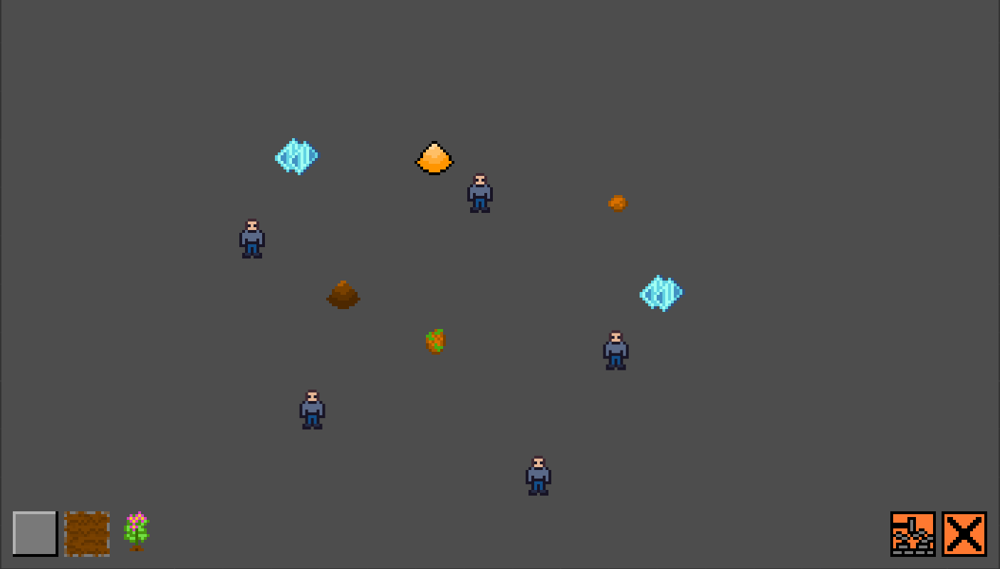

## トップダウンビューの 2D コロニービルダーゲーム

プレイヤーがエージェントに指示を出すことでコロニーを構築し、エージェントの生存を図るゲームです。  
エージェントはすべて AI で、プレイヤーが直接操作することができず、「構築」や「解体」の指示でのみ関節的に操作できます。  
エージェントには空腹があり、食べ続ける必要があります。胃袋が完全に空になると、エージェントは倒れて、死んでしまいます。

Oxygen Not Included からインスピレーションを受け、現在作っているゲームです。  
C# でプログラミングしており、Unity バージョンと Godot バージョンがあります。  
完全に一人で制作しています。

### ダウンロード

- Windows
  - [Colony-builder-windows-x64.zip](https://github.com/ershn/spaceship_game_godot/releases/download/v0.1.0-alpha/Colony-builder-v0.1.0-alpha-windows-x64.zip)
  - ゲームを起動するには、`zip`ファイルを展開して、`exe`ファイルを実行してください
- macOS
  - TBA

### 捜査方法

マウスの左クリックですべて捜査可能です。  
画面下部にあるボタンをクリックしてから、マップのどこかをクリックすると、エージェントに指示を出せます。  
手が空いたエージェントからその指示を実行します。

ボタンの意味は以下の通りです。

| ボタン                                                | 意味                                                 |
| ----------------------------------------------------- | ---------------------------------------------------- |
|          | 鋼のタイルを作る                                       |
|            | 土のタイルを作る                                       |
|        | ジャガイモを埋める （土のタイルでのみできる） |
|      | 指示をキャンセルする                                 |
|  | 作られたものを解体する                               |

以下の表で各アイテムを説明しています。

アイテム画像 | アイテム名称 | 用途
--- | --- | ---
 | 鋼 | 鋼と土タイルの構築に必要
 | 土 | 土タイルの構築に必要
 | ジャガイモ | エージェントの食べ物
 | ジャガイモの種 | ジャガイモを埋めるには必要
 | 硝酸塩鉱物 | ジャガイモを育てるには必要

### ゲームプレイ動画

[gameplay_video.mp4](assets/videos/gameplay_video.mp4)

<video src="assets/videos/gameplay_video.mp4"></video>

### ソースコード

もともと Unity で作っていたゲームですが、Godot に移行し、現在 Godot バージョンの方を開発しております。  
機能的には Unity バージョンと Godot バージョンは現在ほぼ一緒です。ちょうど Godot への移行が終わったところです。

- Unity バージョン
  - [https://github.com/ershn/spaceship_game](https://github.com/ershn/spaceship_game)
- Godot バージョン
  - [https://github.com/ershn/spaceship_game_godot](https://github.com/ershn/spaceship_game_godot)

### 実装における工夫点

#### async/await を活かした非同期な設計

#### シングルトンはなく、各クラスの行数は抑えられてる

#### ゲームエンティティの挙動はすべてエディター内で設定可能

#### パスファインディングサブシステムを作成

#### カスタムツールの開発で実装コストを軽減
